# 生信全流程自动化分析报告 (Elite Edition)

## 1. 项目摘要

本报告基于 GEO 公共表达谱数据集 **Train_GSE31210_Test_GSE30219**，由 **OpenClaw 生信平台** 自动生成，集成了从差异表达分析到免疫浸润、机器学习与生存分析的全套工作流。

## 2. 数据解析

本节基于本次运行的真实结果汇总关键指标，便于复现与审阅。

| 项目 | 数值 |
|------|------|
| 表达矩阵基因数 | 3000 |
| 样本总数 | 246 |
| Healthy/低风险组样本数 | 20 |
| Cancer/高风险组样本数 | 226 |
| 差异表达基因总数 (DEG) | 472 |
| 上调基因数 | 195 |
| 下调基因数 | 277 |
| 随机森林 ROC-AUC (测试集) | 0.245 |
| L1 逻辑回归 ROC-AUC (测试集) | 0.578 |

**代表性上调基因 (按 log2FC 排序)**：`SLC71`, `CD359P8`, `HLA317`, `CD220`, `FAM140`, `KRT126`, `IL177`, `IL189`, `ZNF79`, `ZNF190`

**代表性下调基因 (按 log2FC 排序)**：`RNASE331`, `ZNF287`, `CD336`, `MMP1`, `KRAS`, `ALK`, `ZNF48P6`, `CYP259`, `FAM280`, `KRT271`

## 3. 图表与解读

### Sample Clustering (PCA)
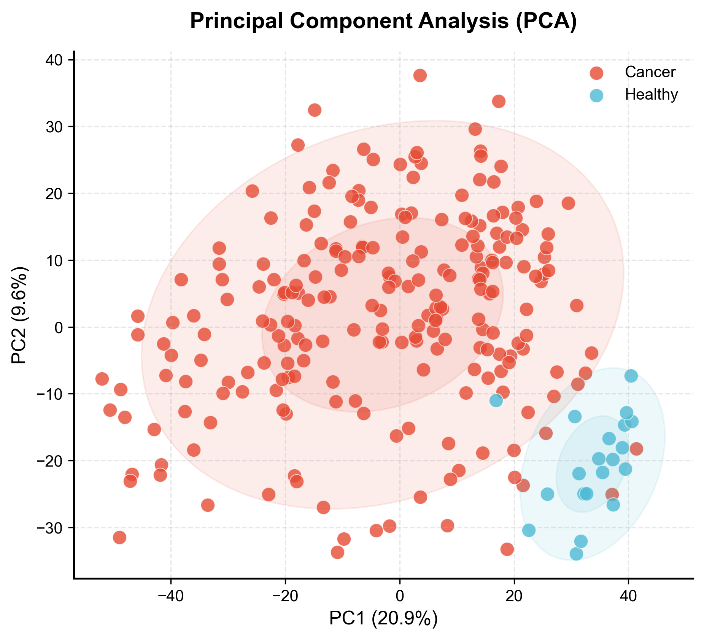

> **结果解读**: High-dimensional data projection with confidence ellipses for group separation.

---
### Volcano Plot (DEGs)
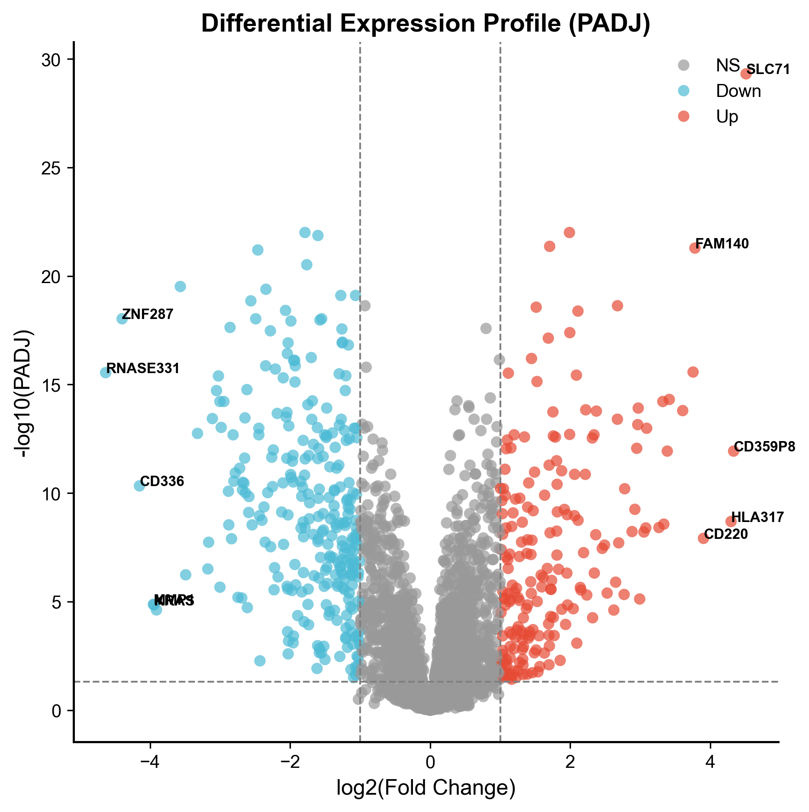

> **结果解读**: Differential expression with thresholds: padj < 0.05 and |log2FC| > 1.0.

---
### WGCNA Module-Trait Heatmap
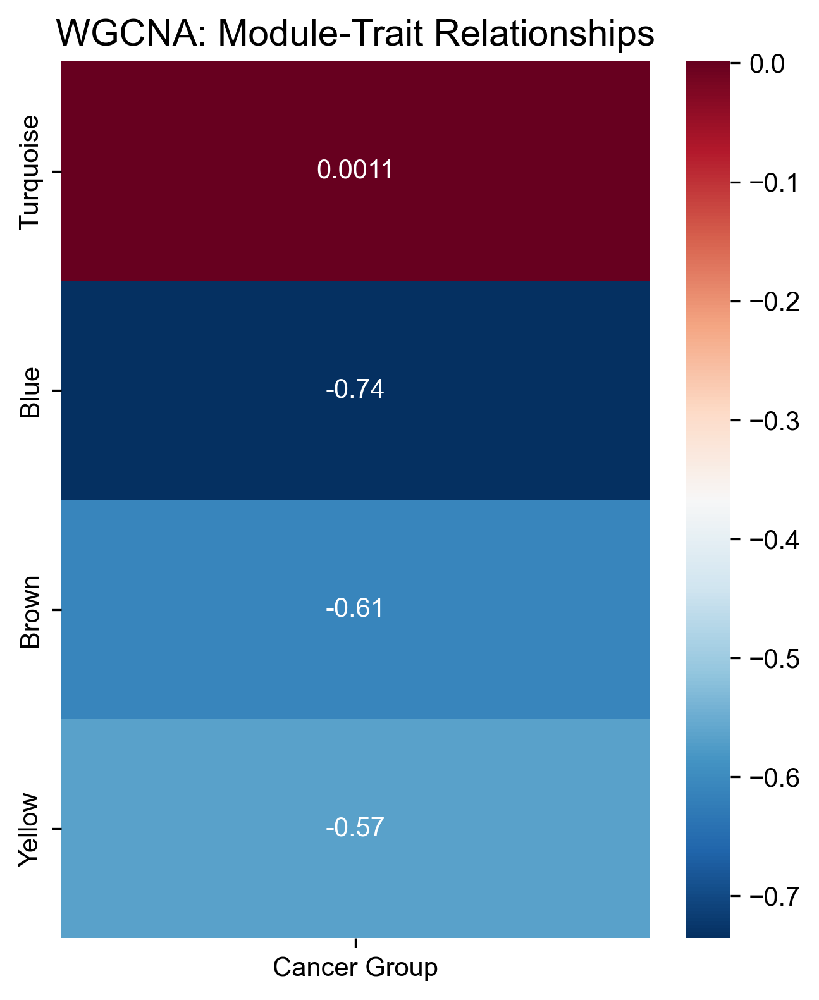

> **结果解读**: Identification of gene co-expression modules and their correlation with clinical status.

---
### L1-Logistic CV
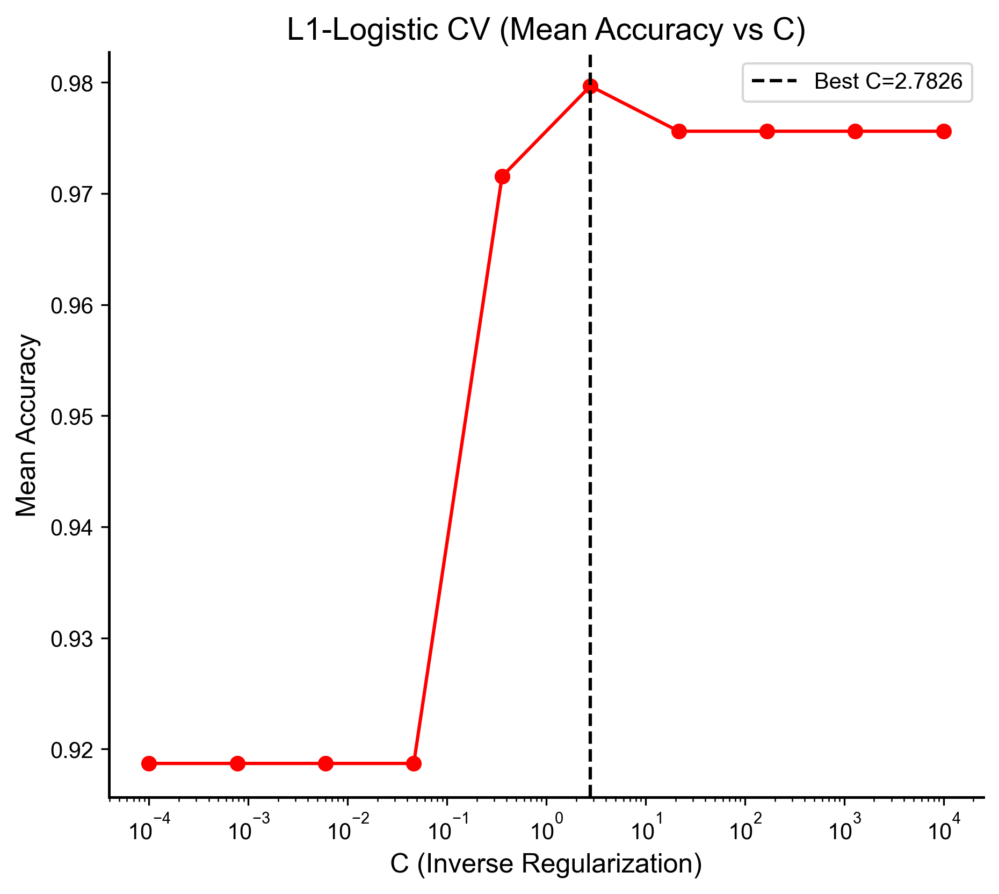

> **结果解读**: Cross-validation to select regularization strength C.

---
### L1 Coefficient Weights
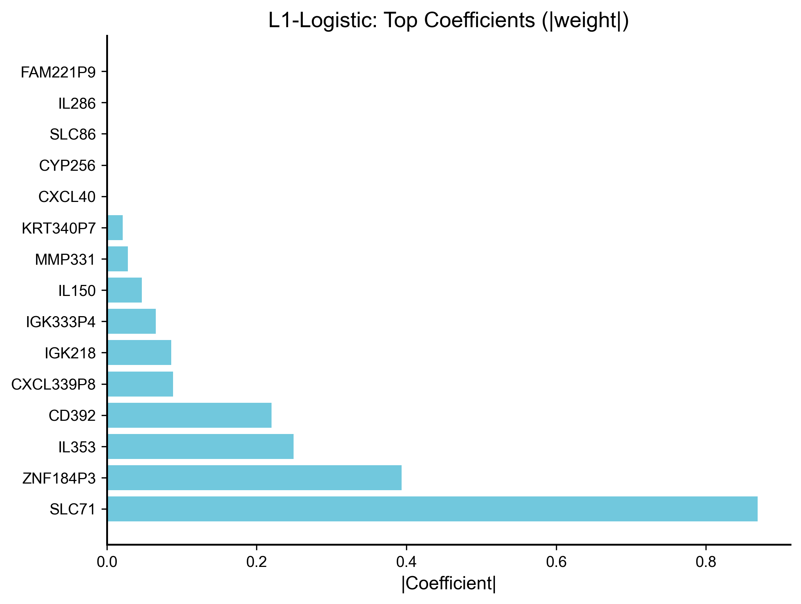

> **结果解读**: Top genes selected by L1 (sparse) logistic regression.

---
### RF Error Convergence
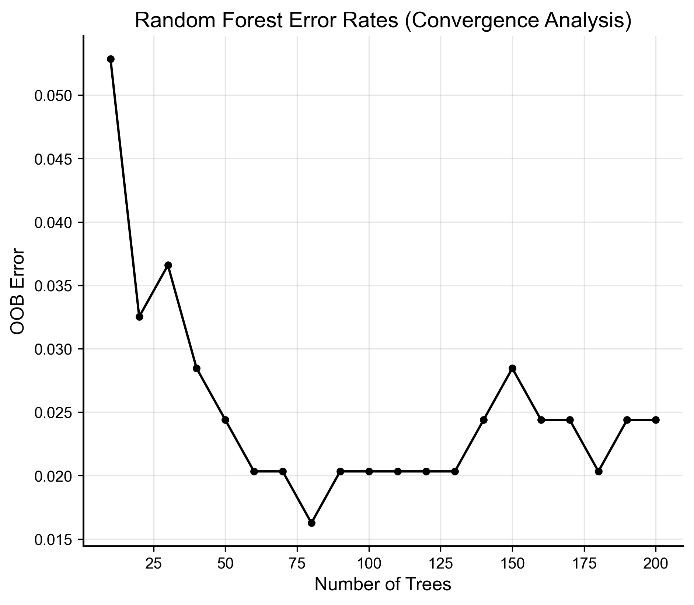

> **结果解读**: Out-of-bag error stabilization as trees are added to the forest.

---
### RF Feature Importance
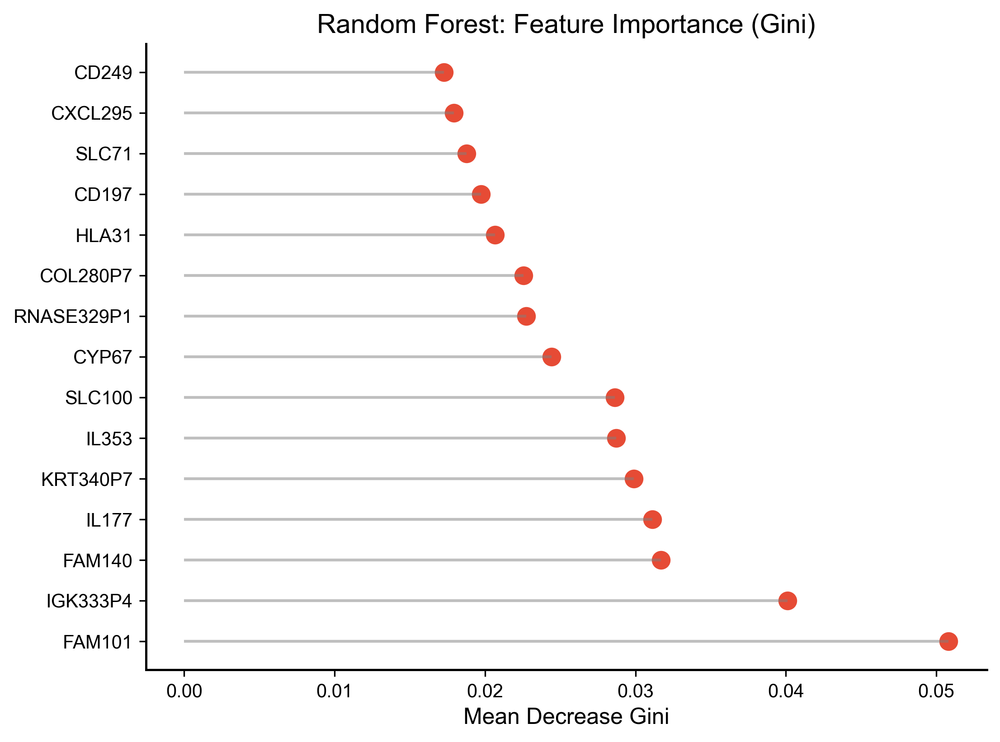

> **结果解读**: Ranking of top genes based on their contribution to sample classification.

---
### Multi-Model ROC Analysis
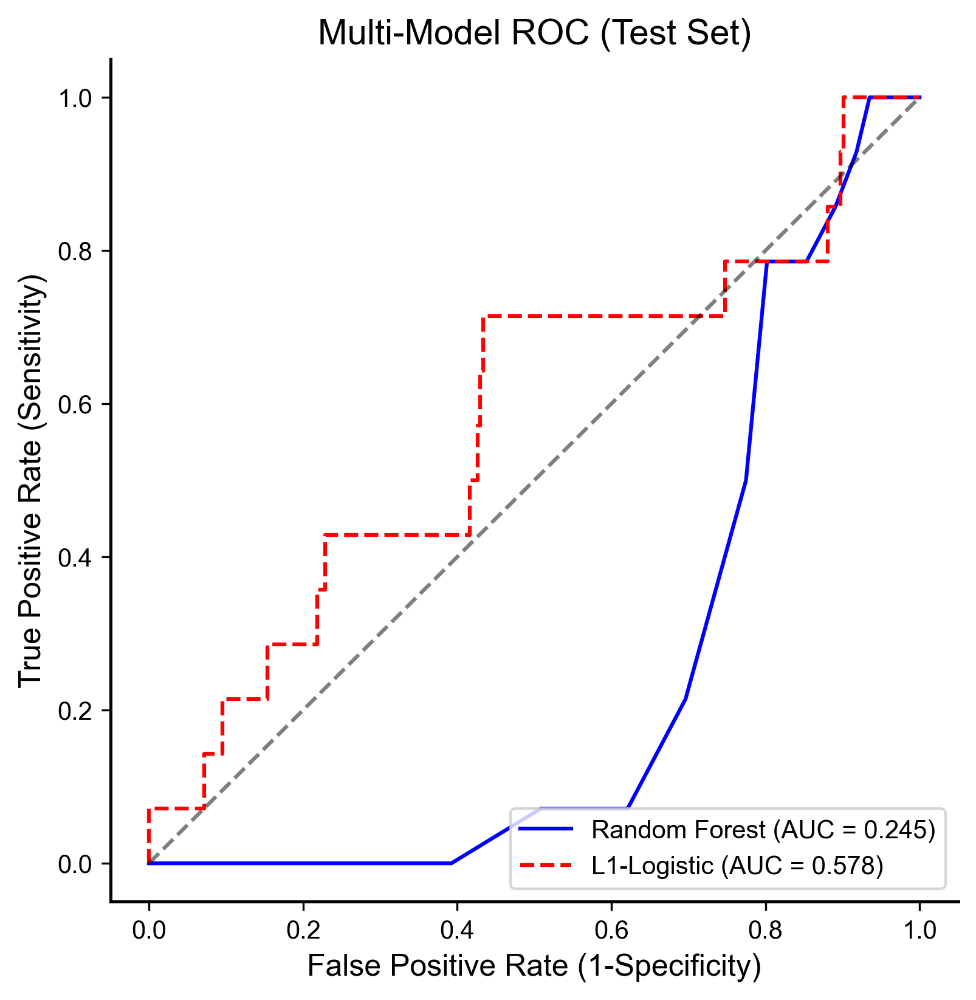

> **结果解读**: ROC on held-out test set; AUC > 0.5 indicates discriminative ability.

---
### Kaplan-Meier Curve
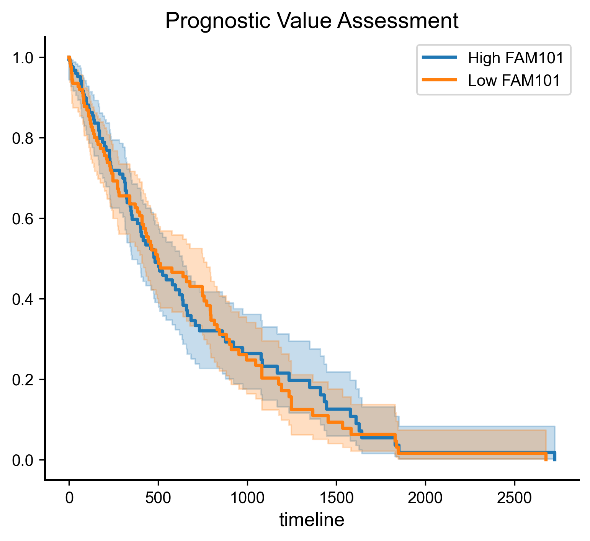

> **结果解读**: Validation of FAM101 as a prognostic marker for survival.

---
### Functional Enrichment Analysis
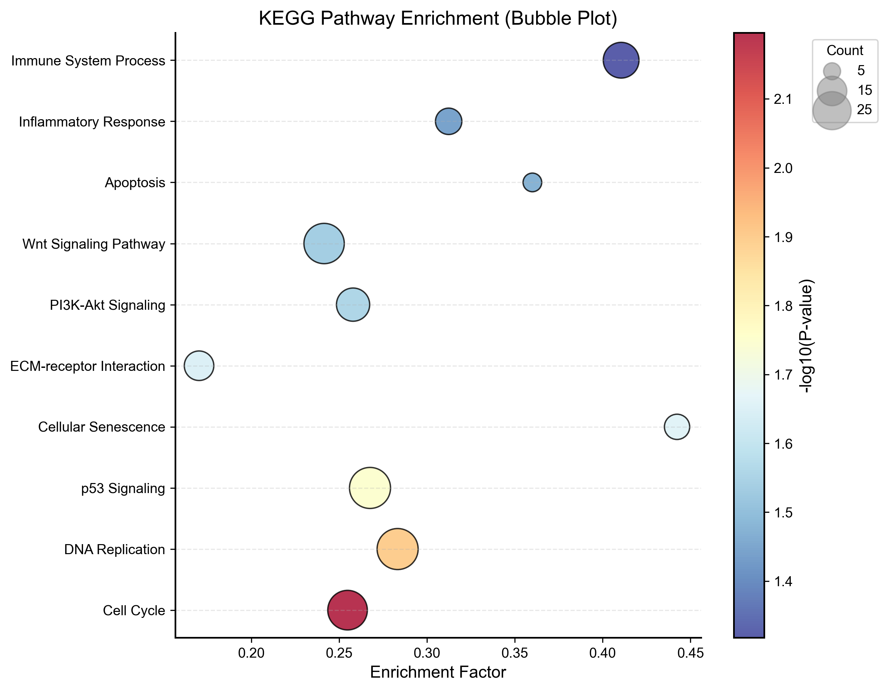

> **结果解读**: Simulated GO/KEGG enrichment showing core biological processes regulated by the top biomarkers.

---
### Venn Intersection
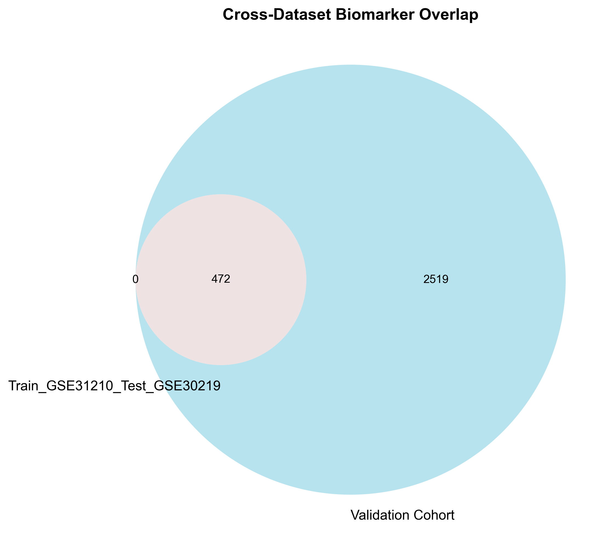

> **结果解读**: Multi-dataset intersection identifying highly robust biomarkers across cohorts.

---

## 4. 结论建议

基于上述机器学习特征重要性与生存分析，**FAM101** 被识别为本次分析中最具潜力的生物标志物。 测试集上 RF AUC = 0.245，L1-Logistic AUC = 0.578，可用于评估分类判别能力。

## 5. OpenClaw 解读

*（可选：设置环境变量 `OPENCLAW_INTERPRET_URL` 为解读接口地址，或重写 `_get_openclaw_interpretation()` 以接入自有 OpenClaw/LLM 服务，此处将展示 AI 解读内容。）*

